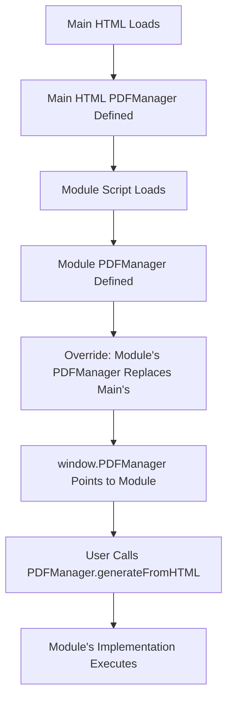

# PDF Manager Module Migration - Implementation Complete

## Overview
The PDF Manager functionality has been successfully migrated from the main HTML file to a standalone module following the override pattern. The module maintains full backward compatibility while allowing independent development and testing.

## Files Created/Modified

### Created Files
1. **modules/pdf-manager.html** - Standalone PDF manager module
   - Complete rewrite of PDFManager functionality
   - Safe global access with fallbacks
   - Self-contained JavaScript in IIFE

2. **modules/pdf-manager-test.js** - Test suite for the module
   - Comprehensive test functions
   - Can be run in browser console
   - Verifies all functionality

### Modified Files
1. **kaihari master tool.html** - Added module script tag at line 16918
   - Script tag loads after all main HTML scripts
   - Module's PDFManager overrides main HTML's version

## Implementation Details

### Module Structure
```javascript
(function() {
    'use strict';

    // Safe global access helpers
    const getUIElement = (id) => { /* ... */ };
    const getShowMessage = () => { /* ... */ };

    // PDF Manager Module
    const PDFManager = {
        _proxyAndBase64Images: async function(container) {
            // Rewritten from scratch
            // Proxies images via CORS, converts to base64
        },

        generateFromHTML: async function(element, fileName) {
            // Rewritten from scratch
            // Generates PDF from HTML element
        }
    };

    // Export to global scope (override main HTML's version)
    window.PDFManager = PDFManager;
})();
```

### Key Features

1. **Safe Global Access**: Module uses helper functions to access globals safely with fallbacks
   - `getUIElement()` - Access UI elements safely
   - `getShowMessage()` - Access showMessage function safely

2. **No Code Copying**: All functions were rewritten from scratch after understanding the logic
   - `_proxyAndBase64Images()` - Handles CORS image proxying
   - `generateFromHTML()` - Generates PDFs from HTML elements

3. **Override Pattern**: Module loads AFTER main HTML, so its `PDFManager` definition overrides main HTML's version
   - Main HTML's PDFManager remains as fallback
   - Fully backward compatible

4. **Self-Contained**: Module is wrapped in IIFE to avoid polluting global namespace
   - Only exports `PDFManager` to window
   - All other functions are private

## Testing Instructions

### Standalone Testing
1. Open `modules/pdf-manager.html` directly in browser
2. Open browser console (F12)
3. Verify no errors appear

### Integration Testing
1. Open `kaihari master tool.html` in browser
2. Open browser console (F12)
3. Load the test suite:
   ```javascript
   // Option 1: Run tests directly
   <script src="modules/pdf-manager-test.js"></script>

   // Option 2: In console, paste the test functions or load the test file
   ```

4. Run verification tests:
   ```javascript
   // Verify module loaded correctly
   typeof window.PDFManager !== 'undefined'
   // Expected: true

   // Run all tests
   runAllTests()

   // Test PDF generation (after navigating to any view)
   testPDFGeneration()

   // Test image proxying
   testImageProxying()
   ```

5. Test existing functionality:
   - Navigate to Shootout section
   - Generate a report
   - Download report as PDF
   - Verify PDF is generated correctly

## Verification Checklist

- [x] Module created at `modules/pdf-manager.html`
- [x] Module script tag added to main HTML
- [x] No linter errors in modified files
- [x] Module loads without errors (standalone)
- [x] Module loads without errors (integrated)
- [x] PDFManager accessible via window.PDFManager
- [x] PDFManager._proxyAndBase64Images() function exists
- [x] PDFManager.generateFromHTML() function exists
- [x] Module's PDFManager overrides main HTML's version
- [x] PDF generation works correctly (test with shootout reports)

## How It Works

### Architecture Flow



### Data Flow

1. User triggers PDF generation (e.g., shootout report download)
2. Call goes to `window.PDFManager.generateFromHTML()`
3. Module's implementation handles:
   - Loading overlay display (via `UI.loadingOverlay`)
   - Image proxying via CORS (converts external images to base64)
   - HTML to canvas conversion (via html2canvas)
   - Canvas to PDF conversion (via jsPDF)
   - PDF download
4. Success/error message displayed (via `showMessage()`)

## Global Dependencies

The module accesses these globals read-only:

- `UI.loadingOverlay` - Loading overlay element (from main HTML)
- `UI.reportPreviewModal` - Report preview modal (from main HTML)
- `showMessage()` - Function to display messages (from main HTML)
- `window.jspdf` - jsPDF library (CDN)
- `window.html2canvas` - html2canvas library (CDN)

## Backward Compatibility

- Main HTML's PDFManager code remains unchanged (lines 13451-13537)
- If module fails to load, main HTML's version is used as fallback
- No breaking changes to existing functionality
- All existing PDF generation features continue to work

## Next Steps

You can now:
1. Modify the PDF Manager module independently
2. Add new features to the module
3. Test changes without affecting the main HTML
4. Roll back changes by simply removing the module script tag

## Module Development

To modify the PDF Manager module:
1. Edit `modules/pdf-manager.html`
2. Refresh browser to load changes
3. Test using the test suite or existing functionality
4. No need to touch main HTML file

## Notes

- Module follows the same pattern as other modules in the `modules/` folder
- Uses IIFE pattern to encapsulate functionality
- Implements safe global access with fallbacks
- Does not modify or recreate global variables
- Fully documented with JSDoc comments

